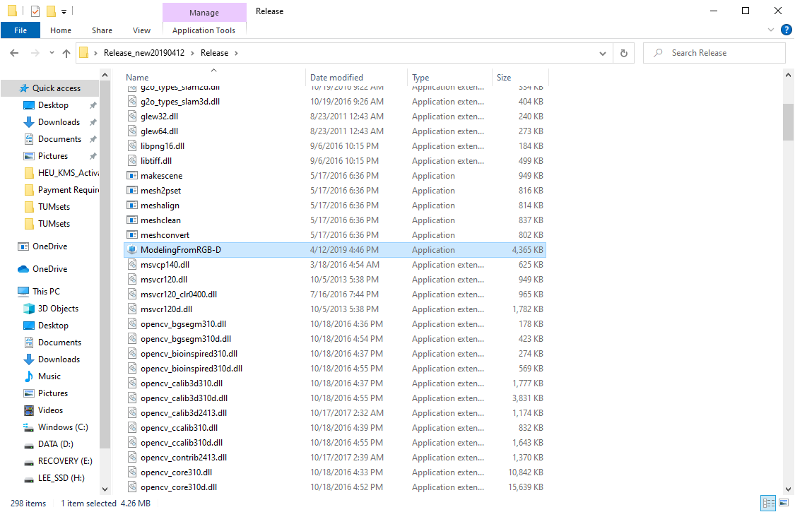
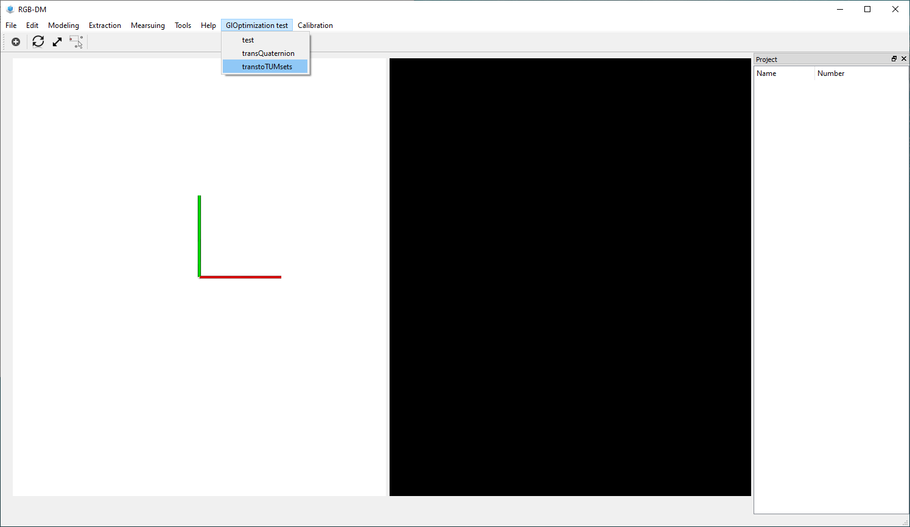
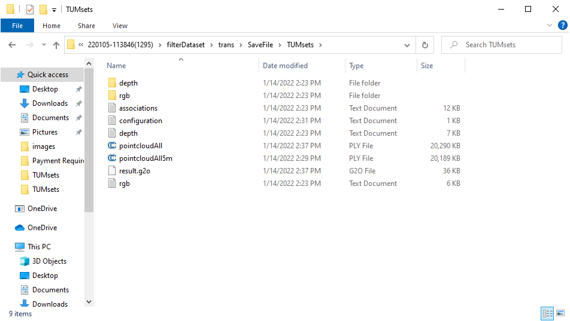
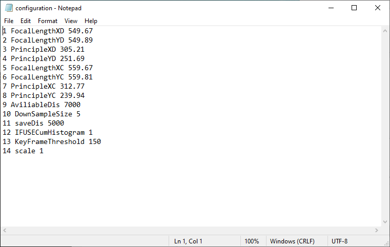
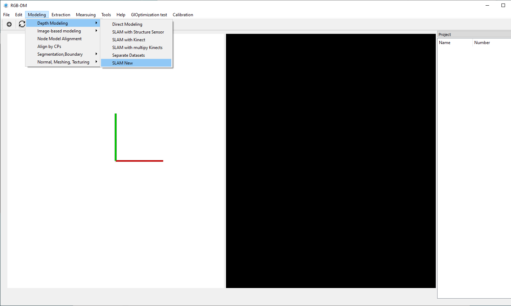

# SS_3D_Reconstruction_Tom
3D models generation with SS
# Usage
## Step1: Data Delete
When some user forget the colse the App when they finish the data collection, there are some data is not need for the data
processing. Please using [Tools](https://github.com/yxliwhu/SS_Data_Preprocessing) to process the data firstly. 
## Step2: Data Format Transformation 
### Open the software in **Release/ModelingFromRGB-D**

### Finish by the designed function 
 (**transtoTUMsets**)

The output data is stored in the directory **[Folder]\trans\SaveFile\TUMsets\**

## Step3: 3D Point Cloud Generation
### Import **configuration** file
Copy [configuration.txt](configuration.txt) to the data folder **[Folder]\trans\SaveFile\TUMsets\**

### Model generation
Using software funciton (**SLAMNew**) to finish this action

The point cloud will be stored in  **[Folder]\trans\SaveFile\TUMsets\porintcloudAll**
